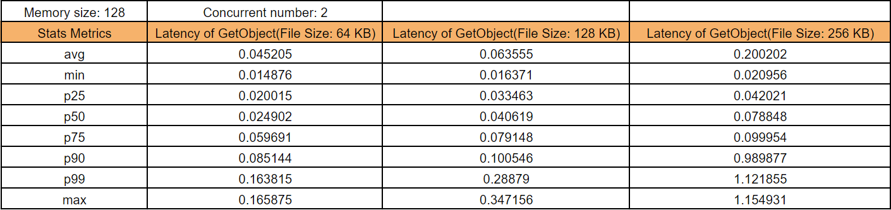
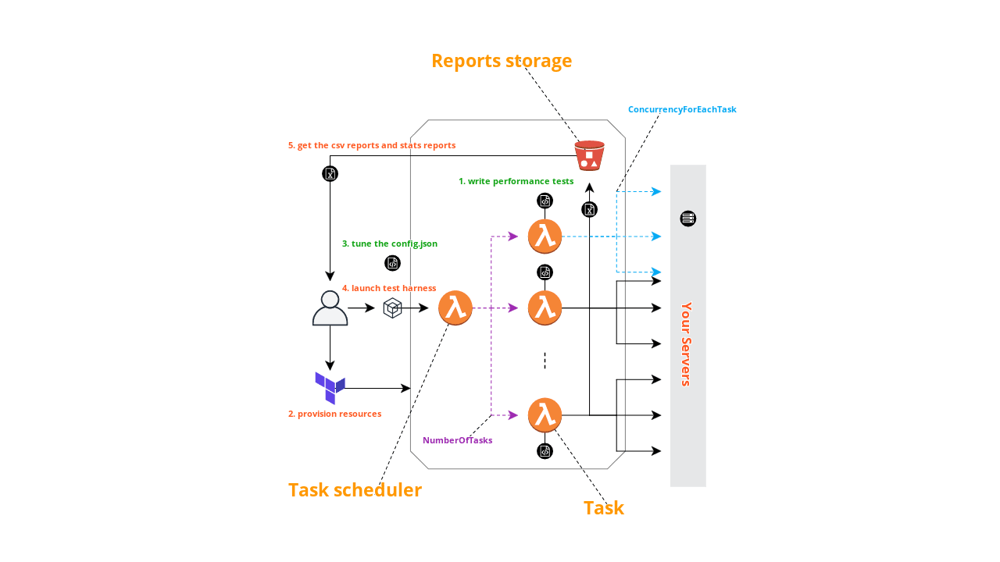

# Test Harness Framework in Go based on AWS Lambda Function

This is a Test Harness Framework(written in Go) based on AWS Lambda Function. It can be used in the following scenarios:

1. Launch a large number of loaders to do performance tests against your services.
2. Do performance tests on AWS services, such as S3, DynamoDB etc.

All you require to do are:

1. Write a code snippet for your scenario in Go.
2. Tune the test parameters & start the tests.

After that, a few reports, such as `raw-data-<TaskName>-<DateTime>-<TaskId>.csv` and `report-<TaskName>-<DateTime>-<TaskId>.csv`, will be automatically generated in `reports` folder.

`report-<TaskName>-<DateTime>-<TaskId>.csv` file contains some stats information, such as avg, min, max, p25, p50, p75, p90 and p99, which are calculated beyond the `raw-data-<TaskName>-<DateTime>-<TaskId>.csv` file.

In addition, it will merged reports base on the same `TaskName` but with different test conditions, the merged reports name is something like `raw-data-<TaskName>-<DateTime>.csv` and `report-<TaskName>-<DateTime>.csv`, you can import them into sheet to compare the benchmarks or visualize them. Below is the stats results of using Test Harness Framework to test the laytency of `GetObject` operation provided by AWS S3.



And the corresponding visualization version is shown below:


## Prerequisites

Before you use the framework, please install the following tools on top of **Linux OS**, and pay attention to their versions.

* Install Go, and make sure its version is at least `v1.14`. After successfully install, type the following command to make sure you are on the right version:

```bash
$ go version
go version go1.14.2 linux/amd64
```

* Install Terraform, and make sure its version is `v0.12.19`. Type the following command to make sure you are on the right version:

```bash
terraform version
Terraform v0.12.19
```

* Install [dep](https://golang.github.io/dep/docs/installation.html)

* Clone the framework and prepare dependencies

Only execute the following command at the first time when using Test Harness Framework.

```bash
git clone https://github.com/2cloudlab/test-harness-framework-go.git
cd test-harness-framework-go
dep ensure
```

## Write your `*Performancer.go` and tune the `config.json`

Before you write `*Performancer.go` and tune the `config.json`, you should know how Test Harness Framework is designed. Below is an architecture overview of Test Harness Framework:



It consists of 3 parts:

1. Task scheduler
2. Task
3. Reports storage

You just execute `make run ...` to invoke task scheduler, which will async invoke tasks according to the parameters in `config.json`. Each task is expected to generate metrics data points that will be automatically encoded to `json` format and sent to Reports storage.

You are required to provide 2 things:

One is Writing your own `*Performancer.go` performance test cases following below principles:

* Define a S3**Performancer.go** file, and implements `Start` and `Init` function. You must make sure the file is end with the suffix `Performancer.go`.

```go
package main

// S3 performancer
type S3Performancer struct {
}

func (s3P S3Performancer) Start(ctx context.Context, params EventParams) map[string][]float64 {
    // do performance test
    // and return data points for each metric, something like
    //{
    //    "metricName1" : dataPoints1 []float64,
    //    "metricName2" : dataPoints2 []float64,
    //}
}

func (s3P S3Performancer) Init() {
    // initialize global resources
}
```

* Open `worker-handler.go` file, and add the following command in function `registerAll`

```go
registerPerformancer("S3Performancer", func() Performancer {
    return S3Performancer{}
})
```

The other is `config.json`, which contains parameters you specify to control Task scheduler and Task. The format is `json` and the details is shown below:

```json
[
    {
        "NumberOfTasks" : 6,
        "TaskName" : "S3Performancer",
        "ConcurrencyForEachTask" : 2,
        "NumberOfSamples" : 10,
        "RawJson": "{\"FileSize\" : 7}"
    },
    {
        "NumberOfTasks" : 6,
        "TaskName" : "S3Performancer",
        "ConcurrencyForEachTask" : 2,
        "NumberOfSamples" : 10,
        "RawJson": "{\"FileSize\" : 8}"
    },
    {
        "NumberOfTasks" : 6,
        "TaskName" : "S3Performancer",
        "ConcurrencyForEachTask" : 2,
        "NumberOfSamples" : 10,
        "RawJson": "{\"FileSize\" : 9}"
    }
]
```

The above parameters contains 3 elements, and each has the following fields:

1. NumberOfTasks(required), which is used for controling the number of tasks expected to execute
2. TaskName(required), which is used for specifing the performance test to execute
3. ConcurrencyForEachTask(required), which is used for controling the concurrency a task can boost
4. NumberOfSamples(optional), which is used for controling the number of operations a task can issue
5. RawJson(optional), which is expected to be a custom `json` string

It means that you launch the same performance test(`S3Performancer`), but do 3 experiments under different `FileSize` conditions. Each experiment executes `S3Performancer` 6 times on Task instances, each instance will boost 2 concurrencies and issue 10 operations.

For better understand the usage of these fields, you should check out the demo in `S3Performancer.go`.

## Usage

1. Build from source

```bash
make build
```

2. Provision Infrustructure

```bash
make auto_provision BUCKET_NAME="<replace-with-your-bucket-name>"
```

3. Test deployment

Before you boost a large number of parallel tasks, you should first run the following command to validate the created resources are ready.

```bash
make test BUCKET_NAME="<replace-with-your-bucket-name>"
```

Wait about 1 second, you should see the following results:

```bash
Start ...
Task "b2df6b6b-3565-4ac8-aa01-515500f0d587" is launched
Start to wait about 1 minutes ...

 ...

Merge reports ...
End!
```

If you can't see the similar results, it means you run into troubles in step 2. The troubles may be your AWS credentials have not permissions to operate AWS S3, Lambda and IAM service or you just give a bucket name that conflits with other. If something unexpected happen, you should fix it before going to next step.

4. Launch Test Harness & collect reports

The following command will start your Tasks in parallel, you should tell it from where(`BUCKET_NAME="test-reports-repository"`) and when(`TIME_TO_WAIT="2"`) to start collecting reports.

```bash
make run BUCKET_NAME="<replace-with-your-bucket-name>" TIME_TO_WAIT="<time-to-wait-before-collecting-reports-in-minute>"
```

5. Destroy resources

If you are no longer use the provisioned resources in step 2, make sure to call the following command to destroy them, so that you are not charged by AWS.

```bash
make auto_destroy BUCKET_NAME="<replace-with-your-bucket-name>"
```