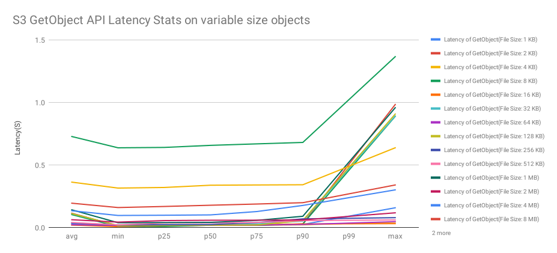

# Test Harness Framework in Go based on AWS Lambda Function

This is a Test Harness Framework(written in Go) based on AWS Lambda Function. It can be used in the following scenarios:

1. Launch a large number of loaders to do performance tests against your services or AWS services.
2. Observe the status of your Lambda function, and optimize it.

All you require to do are:

1. Write a code snippet for your scenario in Go.
2. Tune the test parameters & start the tests & wait for metrics reports.

After that, a few reports, such as `raw-data-<TaskName>-<DateTime>-<TaskId>.csv` and `report-<TaskName>-<DateTime>-<TaskId>.csv`, will be automatically generated in `reports` folder.

`report-<TaskName>-<DateTime>-<TaskId>.csv` file contains some stats information, such as avg, min, max, p25, p50, p75, p90 and p99, which are calculated beyond the `raw-data-<TaskName>-<DateTime>-<TaskId>.csv` file.

In addition, it will merged reports base on the same `TaskName` but with different test conditions, the merged reports name is something like `raw-data-<TaskName>-<DateTime>.csv` and `report-<TaskName>-<DateTime>.csv`, you can import them into sheet to compare the benchmarks or visualize them. Below is a [chart](https://docs.google.com/spreadsheets/d/e/2PACX-1vRLXqNm56689PKUxu_AsMNOZ8wT3v2jBgaXEZjTRt2UPvXoKnCRjF2--NrerHIj6yZXNAOO3CIWjaJA/pubchart?oid=562990831&format=interactive) that visualizes the stats laytency(in Seconds) of AWS S3 `GetObject` GO API issued in Lambda function(memory is 128MB) under different file size(1KB～32MB).



## Prerequisites

Before you use the framework, please install the following tools on top of **Linux OS** or **Mac OS**, and pay attention to their versions.

* Install Go, and make sure its version is at least `v1.14`. After successfully install, type the following command to make sure you are on the right version:

```bash
$ go version
go version go1.14.2 linux/amd64
```

* Install Terraform, and make sure its version is `v0.12.19`. Type the following command to make sure you are on the right version:

```bash
terraform version
Terraform v0.12.19
```

* Install [dep](https://golang.github.io/dep/docs/installation.html) according to the following command:

```bash
// Install dep
curl https://raw.githubusercontent.com/golang/dep/master/install.sh | sh
```

```bash
// After install, execute the following command to verify
dep version
// The output will be something like that:
dep:
 version     : v0.5.4
 build date  : 2019-07-01
 git hash    : 1f7c19e
 go version  : go1.12.6
 go compiler : gc
 platform    : darwin/amd64
 features    : ImportDuringSolve=false
```

* Install [Python](https://www.python.org/downloads/) and [AWS CLI](https://docs.aws.amazon.com/cli/latest/userguide/install-cliv2.html)(use it to configure the credentials info)

```bash
// Install AWS CLI on MAC
$ curl "https://awscli.amazonaws.com/AWSCLIV2.pkg" -o "AWSCLIV2.pkg"
$ sudo installer -pkg AWSCLIV2.pkg -target /
```

```bash
// After install, execute the following command to verify
aws --version
// The output will be something like that:
aws-cli/2.0.36 Python/3.7.4 Darwin/19.6.0 exe/x86_64
```

```bash
// Configure the credentials
aws configure
// Enter your credentials according to the prompts
AWS Access Key ID [None]: <Your Access key ID>
AWS Secret Access Key [None]: <Your Secret access key>
Default region name [None]: <Your prefer region name>
Default output format [None]:
```

* Clone the framework and prepare dependencies

Only execute the following command at the first time when using Test Harness Framework.

```bash
git clone https://github.com/2cloudlab/test-harness-framework-go.git
cd test-harness-framework-go
dep ensure
```

## Write your `*Performancer.go` and tune the `config.json`

Before you write `*Performancer.go` and tune the `config.json`, you should know how Test Harness Framework is designed. Below is an architecture overview of Test Harness Framework:


It consists of 3 parts:

1. Task scheduler
2. Task
3. Reports storage

You just execute `make run ...` to invoke task scheduler, which will async invoke tasks according to the parameters in `config.json`. Each task is expected to generate metrics data points that will be automatically encoded to `json` format and sent to Reports storage.

You are required to provide 2 things:

One is Writing your own `*Performancer.go` performance test cases following below principles:

* Define a S3**Performancer.go** file, and implements `Start` and `Init` function. You must make sure the file is end with the suffix `Performancer.go`.

```go
package main

// S3 performancer
type S3Performancer struct {
}

func (s3P S3Performancer) Start(ctx context.Context, params EventParams) map[string][]float64 {
    // do performance test
    // and return data points for each metric, something like
    //{
    //    "metricName1" : dataPoints1 []float64,
    //    "metricName2" : dataPoints2 []float64,
    //}
}

func (s3P S3Performancer) Init() {
    // initialize global resources
}
```

* Open `worker-handler.go` file, and add the following command in function `registerAll`

```go
registerPerformancer("S3Performancer", func() Performancer {
    return S3Performancer{}
})
```

The other is `config.json`, which contains parameters you specify to control Task scheduler and Task. The format is `json` and the details is shown below:

```json
[
    {
        "NumberOfTasks" : 6,
        "TaskName" : "S3Performancer",
        "ConcurrencyForEachTask" : 2,
        "NumberOfSamples" : 10,
        "RawJson": "{\"FileSize\" : 7}"
    },
    {
        "NumberOfTasks" : 6,
        "TaskName" : "S3Performancer",
        "ConcurrencyForEachTask" : 2,
        "NumberOfSamples" : 10,
        "RawJson": "{\"FileSize\" : 8}"
    },
    {
        "NumberOfTasks" : 6,
        "TaskName" : "S3Performancer",
        "ConcurrencyForEachTask" : 2,
        "NumberOfSamples" : 10,
        "RawJson": "{\"FileSize\" : 9}"
    }
]
```

The above parameters contains 3 elements, and each has the following fields:

1. NumberOfTasks(required), which is used for controling the number of tasks expected to execute
2. TaskName(required), which is used for specifing the performance test to execute
3. ConcurrencyForEachTask(optional), which is used for controling the concurrency a task can boost
4. NumberOfSamples(optional), which is used for controling the number of operations a task can issue
5. RawJson(optional), which is expected to be a custom `json` string

It means that you launch the same performance test(`S3Performancer`), but do 3 experiments under different `FileSize` conditions. Each experiment executes `S3Performancer` 6 times on Task instances, each instance will boost 2 concurrencies and issue 10 operations.

For better understand the usage of these fields, you should check out the demo in `S3Performancer.go`.

**Note**: This framework will automatically upload 16 objects, each with object size varies from 2^0 to 2^15 KB. You can use the following function to get the object key and use it for getting object:

```go
// get 1 KB object's key
getObjectName(1)
// get 32 MB object's key
getObjectName(16)
```

## Steps to follow

If you add or modify any of `*Performancer.go` files, you must execute 1 and 2 steps before step 4.

If you just want to tune the parameters and collect stats reports, just execute step 4.

If you finish the test jobs and decide not to use the framework any more, make sure to clear the resources by running step 5 so that you are not charged by AWS.

1. Build from source

```bash
make build
```

2. Provision Infrustructure

This framework will provision 3 types of resources, such as a S3, multiples Worker Handler Lambda functions and a Test Harness Framework Lambda function. Before you run below `make auto_provision ...` command, you should open `worker-handler-config.json`file, and tune the memory related parameters in order to determine how many Worker Handler Lambda functions will be created. The default content of this `json` file is shown below:

```json
{
    "FunctionNamePrefix" : "worker-handler",
    "MaxFunctionMemoryInMB" : 3008,
    "IncreaseMemoryByInMB" : 64,
    "MinFunctionMemoryInMB" : 128
}
```

You should only modify parameters `MinFunctionMemoryInMB` and `MaxFunctionMemoryInMB`. If you want to create 1 Worker Handler Lambda function with memory size: 128MB, you just change `MaxFunctionMemoryInMB` from 3008 to 128. If you want to create 3 Worker Handler Lambda functions whose memory size is 1664MB, 1728MB , 1792MB respectively, you just update `MinFunctionMemoryInMB` to 1664 and `MaxFunctionMemoryInMB` to 1792.

After tuning the parameters in `worker-handler-config.json` file, execute the following command to provision infrastructures:

```bash
make auto_provision BUCKET_NAME="<replace-with-your-bucket-name>"
```

After successfully provisioning infrastructures, you should wait a few minutes before AWS can make these resources available to you.

1. Test deployment

Before you boost a large number of parallel tasks, you should first run the following command to validate the created resources are ready.

```bash
make test BUCKET_NAME="<replace-with-your-bucket-name>"
```

Wait about 1 second, you should see the something like the following result:

```bash
Start ...
Task "6c5c3c9e-d8ce-447f-bb87-a06e1aae01b7" is launched
Start to wait about 1 minutes ...
get report units from S3, key is 6c5c3c9e-d8ce-447f-bb87-a06e1aae01b7 ...
worker handler request id is  0da76936-0257-4f29-8d74-f1fe736f1fc5
worker handler request id is  20f585f3-4ce5-45db-a65b-c3a2c09ac575
worker handler request id is  71c05671-733b-4554-b9ba-11f379654d31
worker handler request id is  83345ae4-f1bd-4b10-bb1c-f42ec033be9c
worker handler request id is  98f3cdfb-3ea6-4d9b-b567-e494b8a11834
worker handler request id is  b29733cf-e9f7-418d-9981-6e592e069359
parse headers ...
aggregate all report units ...
sort each metrics in descending order ...
do stats such as mean, p99, min etc. ...
generate report ...
Merge reports ...
End!
```

If you can't see the similar results, it means you run into troubles in step 2. The troubles may be your AWS credentials have not permissions to operate AWS S3, Lambda and IAM service or you just give a bucket name that conflits with other. If something unexpected happen, you should fix it before going to next step.

Thie `id` in `worker handler request id is  <id>` is a request id for your performance test, you can search more detail performance metrics, such as Duration and Max memory usage, in Log Stream by providing these ids.

4. Launch Test Harness & collect reports

The following command will start your Tasks in parallel, you should tell it from where(`BUCKET_NAME="test-reports-repository"`) and when(`TIME_TO_WAIT="2"`) to start collecting reports.

```bash
make run BUCKET_NAME="<replace-with-your-bucket-name>" TIME_TO_WAIT="<time-to-wait-before-collecting-reports-in-minute>"
```

5. Destroy resources

If you are no longer use the provisioned resources in step 2, make sure to call the following command to destroy them, so that you are not charged by AWS.

```bash
make auto_destroy BUCKET_NAME="<replace-with-your-bucket-name>"
```